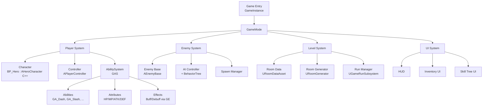

# Roguelike 主项目架构（第 4 - 6 个月）

> 项目代号：**Roguelike Reborn**（暂定，你可以改）  
> 独立仓库：`roguelike-reborn`（第 4 个月初开建）  
> 目标：6 个月后在 itch.io 免费发布，代码开源到 GitHub，作为简历核心作品。

---

## 总体架构



---

## 模块拆解与月度排期

### 第 4 个月：基础架构 + 角色控制

**目标**：角色能跑能打，敌人能被打，数据驱动武器能换。

| 模块 | 实现语言 | 说明 |
|------|---------|------|
| `AHeroCharacter` | C++ | 角色基类，不含具体逻辑 |
| `BP_Hero` | Blueprint | 继承 C++ 基类，配置外观 |
| `UWeaponDataAsset` | C++ | 武器数据资产（伤害、射程、动画） |
| `UInventoryComponent` | C++ | 背包组件 |
| `AEnemyBase` + AI | C++ + BT | 敌人基类 + 行为树 |
| `ADamageZone` | C++ | 可被攻击的区域检测 |
| Input | Enhanced Input | UE5 现代输入系统 |

**关键决策**：
- **角色基类用 C++**，但蓝图子类配置外观和数据（行业最佳实践）
- **武器系统必须数据驱动**：`DataAsset` 或 `DataTable`，不要硬编码
- **攻击判定用 Trace**（不用 Hitbox Collision），精度更好

### 第 5 个月：GAS 技能系统

**目标**：把角色攻击、敌人攻击、Buff/Debuff 全部迁移到 GAS。

| 模块 | 说明 |
|------|------|
| `UHeroAttributeSet` | 属性集：HP / MaxHP / MP / ATK / DEF / CritRate |
| `UHeroAbilitySystemComponent` | ASC 核心组件 |
| `GA_Slash` (Gameplay Ability) | 普攻技能 |
| `GA_Dash` | 冲刺技能（带无敌帧） |
| `GA_Ultimate` | 大招技能（可扩展） |
| `GE_Damage` (Gameplay Effect) | 伤害效果 |
| `GE_PoisonDoT` | 中毒持续伤害 |
| `GE_SpeedBuff` | 加速 Buff |
| Gameplay Tags | 所有状态标记（`State.Stun`, `Ability.Active.Dash`） |

**关键决策**：
- 所有伤害、Buff、技能都走 GAS，**不要用普通函数**
- Gameplay Tag 层级要提前设计好
- 每个 Ability 单独一个 C++ 类

**学完这一块就是简历超级加分项。**

### 第 6 个月：过程生成 + 元系统 + 发布

**目标**：像真正的 Roguelike，每局都不一样，可存档，可发布。

| 模块 | 说明 |
|------|------|
| `URoomGenerator` | 过程生成房间（拼接式或 WFC） |
| `URunSubsystem` | Game Instance Subsystem，管整局状态 |
| `USaveGameManager` | 存档系统（元进度、统计） |
| Pickups + Reward | 捡道具、宝箱、金币 |
| Meta Progression | 永久升级（像《哈迪斯》） |
| Pause / Settings Menu | UMG |
| Sound + Music | MetaSounds 基础 |
| Packaging + itch.io 发布 | Windows 打包 |

---

## C++ 类命名规范

UE 有严格的前缀约定，**不遵守会被编译器骂**：

| 前缀 | 类型 | 例 |
|------|------|-----|
| `A` | 继承自 `AActor` | `AHeroCharacter` |
| `U` | 继承自 `UObject`（包括 Component / Subsystem） | `UInventoryComponent` |
| `F` | 结构体、普通 C++ 类 | `FWeaponStats` |
| `I` | 接口 | `IInteractable` |
| `E` | 枚举 | `EDamageType` |
| `T` | 模板 | `TArray<T>` |

蓝图类（资产）通常加 `BP_` 前缀：`BP_Hero`、`BP_Goblin`。

---

## 代码分层原则

```
Source/
├── RoguelikeReborn/
│   ├── Characters/       角色类（Hero, Enemy 基类）
│   ├── Abilities/        GAS 相关（AbilitySet, Abilities, Effects）
│   ├── Components/       可复用组件（Inventory, Health, Stamina）
│   ├── Items/            武器、道具、掉落物
│   ├── AI/               行为树任务、Decorator、Service
│   ├── Level/            房间生成、关卡管理
│   ├── UI/               HUD、Widget
│   ├── Subsystems/       GameInstance/World Subsystem
│   └── RoguelikeReborn.Build.cs
```

**一个规则**：文件夹按**职责**分类，不按**类型**分类。不要搞成 `AllActors/`, `AllComponents/`。

---

## 简历亮点 checklist

做完这个项目，你简历上能写：

- ✅ Built a top-down Roguelike in UE5 C++ over 6 months, published on itch.io with X downloads
- ✅ Designed a GAS-based ability system supporting N abilities and M effects
- ✅ Data-driven weapon & enemy system using Primary Data Assets
- ✅ Procedural level generation with [wave function collapse / room stitching]
- ✅ Save system using `USaveGame` with cross-session meta progression
- ✅ Optimized enemy spawn from X ms to Y ms using Unreal Insights

**每一条都是面试被问的真实题目**。

---

## 常见坑（先知道）

1. **不要在 Tick 里做昂贵操作**（Trace、遍历全部 Actor）
2. **不要在蓝图里写 500 个节点**，超过 30 个就重构
3. **C++ 指针必须用 `UPROPERTY()` 标记**，否则被 GC 掉崩溃
4. **Gameplay Tag 用管理器管理**，不要散落在各处字符串
5. **Git LFS 要在项目初始化前设置**，否则 `.uasset` 塞满仓库
6. **Map 和关卡的命名要稳定**，改名会导致引用断裂

---

## 项目启动清单（第 4 个月 Day 1 用）

- [ ] 新建 GitHub 仓库 `roguelike-reborn`（public）
- [ ] 本地用 UE 创建 Blank C++ 项目（勾选 Starter Content）
- [ ] 配置 `.gitignore`（参考 UE5-Journey 的 .gitignore）
- [ ] 配置 Git LFS：`git lfs install && git lfs track "*.uasset" "*.umap"`
- [ ] 第一次 commit：Empty C++ project
- [ ] 建分支：`dev` + `feature/character-base`
- [ ] 写英文 README（占位即可，包含 Goals / Tech Stack / Status）
